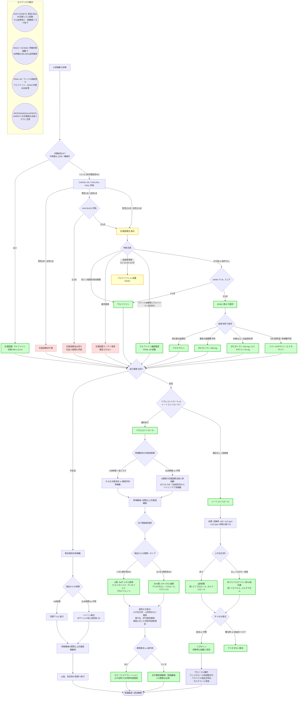

```mermaid
graph TD
    %% スタイル定義
    classDef emergency fill:#ffcccc,stroke:#ff0000,stroke-width:2px;
    classDef decision fill:#ffffcc,stroke:#ffaa00,stroke-width:2px;
    classDef therapy fill:#ccffcc,stroke:#00aa00,stroke-width:2px;
    classDef exclude fill:#ffdddd,stroke:#cc0000,stroke-dasharray: 5 5;
    classDef info fill:#e6e6fa,stroke:#8a2be2;

    %% --- メインフロー開始 ---
    START[心房細動の診断] --> CLASSIFY{弁膜症性AF?<br>中等度以上MS / 機械弁}
    
    %% 弁膜症性の場合（抗凝固療法はワルファリン固定）
    CLASSIFY -->|はい| VALVE_WARFARIN[抗凝固薬: ワルファリン<br>目標 INR 1.6-2.6]:::therapy
    VALVE_WARFARIN --> HEMODYNAMICS
    
    CLASSIFY -->|"いいえ (非弁膜症性AF)"| CHADS[CHADS₂-65 / CHA₂DS₂-VASc 評価]
    
    %% 血栓リスク評価
    CHADS -->|男性0点 / 女性1点| NO_AC[抗凝固療法不要]:::exclude
    NO_AC --> HEMODYNAMICS
    
    CHADS -->|男性1点 / 女性2点| HASBLED{HAS-BLED 評価}
    HASBLED -->|≧3点| NO_AC2[抗凝固療法は控え<br>抗血小板薬を考慮]:::exclude
    NO_AC2 --> HEMODYNAMICS
    HASBLED -->|≦2点| AC_INDICATED[抗凝固療法 適応]:::decision
    
    CHADS -->|男性≧2点 / 女性≧3点| AC_INDICATED
    
    %% 抗凝固薬の選択
    AC_INDICATED --> SPECIAL_COND{特殊背景}
    SPECIAL_COND -->|抗リン脂質抗体症候群| WARFARIN_SELECT[ワルファリン]:::therapy
    SPECIAL_COND -->|維持透析| DIALYSIS_NOTE[抗凝固薬ルーチン使用<br>推奨されない]:::exclude
    DIALYSIS_NOTE --> HEMODYNAMICS
    SPECIAL_COND -->|高度腎障害<br>Ccr 15-30 mL/分| RENAL_CHOICE[ワルファリン or 減量 DOAC]:::decision
    SPECIAL_COND -->|"フレイル高齢者 (ワルファリン安定中)"| FRAIL_WARF[ワルファリン継続推奨<br>FRAIL-AF試験]:::therapy
    FRAIL_WARF --> HEMODYNAMICS
    SPECIAL_COND -->|その他 or 条件なし| SAMETT2R2{SAMe-TT₂R₂ スコア}
    
    %% SAMe-TT2R2 分岐
    SAMETT2R2 -->|0-2点| WARFARIN_SELECT
    SAMETT2R2 -->|≧3点| DOAC_SELECT[DOAC 群より選択]:::therapy
    
    %% DOAC 個別選択
    DOAC_SELECT --> DOAC_CHOICE{患者背景で選択}
    DOAC_CHOICE -->|消化管出血既往| APIX[アピキサバン]:::therapy
    DOAC_CHOICE -->|最高の脳梗塞予防| DABI150[ダビガトラン 150 mg]:::therapy
    DOAC_CHOICE -->|80歳以上 / 出血高危惧| DABI110[ダビガトラン 110 mg / エドキサバン 15 mg]:::therapy
    DOAC_CHOICE -->|1日1回希望 / 除細動予定| RIVA_EDOX[リバーロキサバン / エドキサバン]:::therapy
    APIX --> HEMODYNAMICS
    DABI150 --> HEMODYNAMICS
    DABI110 --> HEMODYNAMICS
    RIVA_EDOX --> HEMODYNAMICS
    WARFARIN_SELECT --> HEMODYNAMICS
    
    %% ---- 血行動態評価と不整脈戦略 ----
    HEMODYNAMICS{血行動態 安定?}
    HEMODYNAMICS -->|不安定| EMERG_CV[緊急電気的除細動]
    EMERG_CV --> DURATION_EMERG{発症からの時間}
    DURATION_EMERG -->|"<48時間"| EMERG_DC[同期下 DC 施行]
    DURATION_EMERG -->|≧48時間 or 不明| HEPARIN_DC[ヘパリン静注<br>APTT 1.5-2倍に延長後 DC]
    HEPARIN_DC --> EMERG_POST[除細動後4週間以上抗凝固薬継続]
    EMERG_DC --> EMERG_POST
    EMERG_POST --> END_EMERG[以後、安定時の管理へ移行]
    
    HEMODYNAMICS -->|安定| RATE_RHYTHM{リズムコントロール or<br>レートコントロール?}
    
    %% 戦略選択基準
    RATE_RHYTHM -->|適応あり| RHYTHM_FLOW[リズムコントロール]:::therapy
    RATE_RHYTHM -->|適応なし / 高齢者| RATE_FLOW[レートコントロール]:::therapy
    
    %% レートコントロール詳細
    RATE_FLOW --> TARGET_HR[目標: 安静時 <80〜110 bpm<br>>120 bpm 持続を避ける]
    TARGET_HR --> RATE_CHOICE1{心不全合併?}
    RATE_CHOICE1 -->|あり| BB_HF[β遮断薬<br>例: ビソプロロール, カルベジロール]:::therapy
    RATE_CHOICE1 -->|なし / COPD・喘息| CA_BLOCKER[非ジヒドロピリジン系Ca拮抗薬<br>例: ベラパミル, ジルチアゼム]:::therapy
    BB_HF --> RATE_SECOND{不十分な場合}
    CA_BLOCKER --> RATE_SECOND
    RATE_SECOND -->|追加 or 代替| DIGOXIN[ジゴキシン<br>安静時心拍数に有効]:::therapy
    RATE_SECOND -->|難治性 or 低血圧リスク| AMIO_RATE[アミオダロン静注]:::therapy
    DIGOXIN --> RATE_TIPS[プロトコル備考:<br>ランジオロール持続静注可<br>ベラパミル低血圧時は<br>カルチコール併用]:::info
    
    %% リズムコントロール詳細
    RHYTHM_FLOW --> RHYTHM_AC{除細動前の抗凝固管理}
    RHYTHM_AC -->|"<48時間 + 低リスク"| DIRECT_CV[そのまま電気的 or 薬理学的除細動]
    RHYTHM_AC -->|≧48時間 or 不明| THREE_WEEK_AC[3週間の抗凝固療法後に除細動<br>または TEE で血栓陰性ならヘパリン下で除細動]
    THREE_WEEK_AC --> CV_POST[除細動後 4週間以上抗凝固継続]
    DIRECT_CV --> CV_POST
    CV_POST --> AAD_CHOICE{抗不整脈薬選択}
    
    AAD_CHOICE --> AF_DURATION{発症からの期間 / タイプ}
    AF_DURATION -->|"<7日 (発作性AF)"| IC_DRUG[Ic群: Naチャネル遮断<br>ピルシカイニド, フレカイニド,<br>プロパフェノン]:::therapy
    AF_DURATION -->|"≧7日 (持続性AF)"| III_DRUG[III/IV群: Kチャネル遮断<br>アミオダロン, ソタロール,<br>ベプリジル]:::therapy
    
    IC_DRUG --> AAD_DETAIL[選択の注意点:<br>心不全合併→心抑制のない薬剤<br>腎不全→肝代謝型薬剤<br>誘因に応じた受容体遮断選択]
    III_DRUG --> AAD_DETAIL
    AAD_DETAIL --> REFRACTORY{薬物無効 or 副作用}
    REFRACTORY -->|はい| ABLATION[カテーテルアブレーション<br>心不全例では早期考慮推奨]:::therapy
    REFRACTORY -->|いいえ| AAD_CONTINUE["抗不整脈薬継続（除細動後2-4週間は必須）"]:::therapy
    AAD_CONTINUE --> END_RHYTHM
    
    ABLATION --> END_RHYTHM
    
    %% 終端
    END_RHYTHM([管理継続 / 経過観察])
    END_EMERG --> END_RHYTHM
    RATE_TIPS --> END_RHYTHM

    %% 注釈
    subgraph Legend[エビデンスの要点]
        EAST((EAST-AFNET4: 発症1年以内早期リズム制御<br>で心血管死亡・脳梗塞リスク低下)):::info
        RACE7((RACE 7 ACWAS: 待機的除細動で<br>48時間以内に69%自然復帰)):::info
        FRAIL((FRAIL-AF: フレイル高齢者で<br>ワルファリン→DOAC切替は出血増)):::info
        ARTESIA((ARTESIA/NOAH-AFNET6:<br>AHREsへの抗凝固は出血リスクに注意)):::info
    end
```
