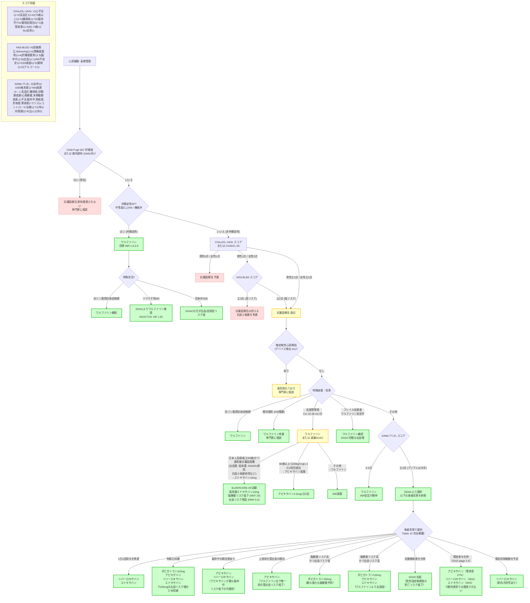

```mermaid
graph TD
    classDef decision fill:#ffffcc,stroke:#ffaa00,stroke-width:2px;
    classDef therapy fill:#ccffcc,stroke:#00aa00,stroke-width:2px;
    classDef exclude fill:#ffdddd,stroke:#cc0000,stroke-dasharray: 5 5;
    classDef info fill:#e6e6fa,stroke:#8a2be2;

    START[心房細動: 長期管理] --> CONTRA{"Child-Pugh B/C 肝硬変<br>または 維持透析 (DM以外)?"}
    CONTRA -->|"はい (禁忌)"| NO_AC_SPECIAL[抗凝固療法 原則推奨されない<br>専門家に相談]:::exclude
    CONTRA -->|"いいえ"| TYPE{"弁膜症性AF?<br>中等度以上MS / 機械弁"}

    %% ---- 弁膜症性 ----
    TYPE -->|"はい (弁膜症性)"| VALVE_WARFARIN[ワルファリン<br>目標 INR 1.6-2.6]:::therapy
    VALVE_WARFARIN --> SPECIAL_WARF{特殊状況?}
    SPECIAL_WARF -->|"抗リン脂質抗体症候群"| APS_CONFIRM[ワルファリン継続]:::therapy
    SPECIAL_WARF -->|"リウマチ性MS"| INVICTUS[DOACよりワルファリン推奨<br>INVICTUS: HR 1.53]:::therapy
    SPECIAL_WARF -->|"生体弁のみ"| BIOVALVE[DOACの方が出血/血栓症リスク低]:::therapy

    %% ---- 非弁膜症性 ----
    TYPE -->|"いいえ (非弁膜症性)"| CHADS[CHA₂DS₂-VASc スコア<br>または CHADS₂-65]
    
    CHADS -->|"男性0点 / 女性1点"| NO_AC[抗凝固療法 不要]:::exclude
    
    CHADS -->|"男性1点 / 女性2点"| HASBLED{HAS-BLED スコア}
    HASBLED -->|"≧3点 (高リスク)"| NO_AC2[抗凝固療法は控える<br>抗血小板薬を考慮]:::exclude
    HASBLED -->|"≦2点 (低リスク)"| INDICATED[抗凝固療法 適応]:::decision
    
    CHADS -->|"男性≧2点 / 女性≧3点"| INDICATED

    %% ---- 無症候性心房頻拍 ----
    INDICATED --> AHRE{"無症候性心房頻拍<br>(デバイス検出 etc)?"}
    AHRE -->|"あり"| CONSULT_AHRE[意見割れており<br>専門家に相談]:::decision
    AHRE -->|"なし"| SPECIAL{特殊病態・背景}

    %% ---- 特殊病態 ----
    SPECIAL -->|"抗リン脂質抗体症候群"| WF_APS[ワルファリン]:::therapy
    SPECIAL -->|"維持透析 (DM関連)"| WF_DM[ワルファリン考慮<br>専門家に相談]:::therapy
    SPECIAL -->|"高度腎障害<br>Ccr 15-30 mL/分"| CKD_CHOICE[ワルファリン<br>または 減量DOAC]:::decision
    CKD_CHOICE -->|"日本人高齢者(≧80歳)かつ<br>通常量抗凝固困難<br>(出血歴, 低体重, NSAIDs併用,<br>抗血小板薬併用など)<br>→エドキサバン15mg"| EDOX15["ELDERCARE-AF試験<br>低用量エドキサバン15mg<br>脳梗塞リスク低下 (NNT 24)<br>出血リスク増加 (NNH 5.6)"]:::therapy
    CKD_CHOICE -->|"80歳以上/≦60kg/Cr≧1.5<br>の2項目該当<br>→アピキサバン減量"| APIX25[アピキサバン2.5mg1日2回]:::therapy
    CKD_CHOICE -->|"その他<br>→ワルファリン"| WF_CKD[INR調節]:::therapy

    SPECIAL -->|"フレイル高齢者<br>ワルファリン安定中"| FRAIL_WARF[ワルファリン継続<br>DOAC切替は出血増]:::therapy

    SPECIAL -->|"その他"| SAMETT2R2{SAMe-TT₂R₂ スコア}
    SAMETT2R2 -->|"0-2点"| WF_STANDARD[ワルファリン<br>INR安定が期待]:::therapy
    SAMETT2R2 -->|"≧3点 (アジア人は大半)"| DOAC_SELECT[DOACより選択<br>以下の患者背景を参照]:::therapy

    DOAC_SELECT --> DOAC_CHOICE{患者背景で選択<br>（Table 10 完全網羅）}

    %% ---- DOAC 選択分岐（Table 10 全9項目）----
    DOAC_CHOICE -->|"1日1回投与を希望"| ONEDAY[リバーロキサバン<br>エドキサバン]:::therapy
    DOAC_CHOICE -->|"年齢≧80歳"| AGE80[ダビガトラン110mg<br>アピキサバン<br>リバーロキサバン<br>エドキサバン<br>※150mgは出血リスク増のため回避]:::therapy
    DOAC_CHOICE -->|"脳卒中の既往歴あり"| STROKE_HX[アピキサバン<br>リバーロキサバン<br>（アピキサバンが最も脳卒中<br>リスク低下の可能性）]:::therapy
    DOAC_CHOICE -->|"上部消化管出血の既往"| UGI_BLEED[アピキサバン<br>（ワルファリン比で唯一<br>消化管出血リスク低下）]:::therapy
    DOAC_CHOICE -->|"脳梗塞リスク高<br>かつ出血リスク低"| HIGHSTROKE_LOWBLEED[ダビガトラン150mg<br>（最も強力な脳梗塞予防）]:::therapy
    DOAC_CHOICE -->|"脳梗塞リスク高<br>かつ出血リスク高"| HIGHSTROKE_HIGHBLEED[ダビガトラン110mg<br>アピキサバン<br>エドキサバン<br>（ワルファリンより出血低）]:::therapy
    DOAC_CHOICE -->|"冠動脈疾患を合併"| CAD[DOAC全般<br>（急性冠症候群後の<br>死亡リスク低下）]:::therapy
    DOAC_CHOICE -->|"腎疾患を合併<br>（CKD stage 3-4）"| RENAL[アピキサバン（腎排泄27%）<br>リバーロキサバン（35%）<br>エドキサバン（50%）<br>※維持透析では推奨されない]:::therapy
    DOAC_CHOICE -->|"電気的除細動を予定"| CARDIOVERSION[リバーロキサバン<br>（前向き研究あり）]:::therapy

    %% ---- スコア詳細（横並びで縦サイズ抑える）----
    subgraph "スコア詳細"
        direction LR
        CHADS_DETAIL["CHA₂DS₂-VASc: C(心不全1)/ H(高血圧1)/ A2(75歳以上2)/ D(糖尿病1)/ S2(脳卒中/TIA/塞栓症既往2)/ V(血管疾患1)/ A(65-74歳1)/ Sc(女性1)"]:::info
        HASBLED_DETAIL["HAS-BLED: H(収縮期≧160mmHg1)/ A(腎機能異常1)+A(肝機能異常1)/ S(脳卒中1)/ B(出血1)/ L(INR不安定1)/ E(65歳超1)/ D(薬剤1)+D(アルコール1)"]:::info
        SAMETT2R2_DETAIL["SAMe-TT₂R₂: S(女性1)/ A(60歳未満1)/ Me(病歴>2→1:高血圧,糖尿病,冠動脈疾患/心筋梗塞,末梢動脈疾患,心不全,脳卒中,肺疾患,肝疾患,腎疾患)/ T(リズムコントロール治療1)/ T(2年以内喫煙2)/ R(白人以外2)"]:::info
    end
```
